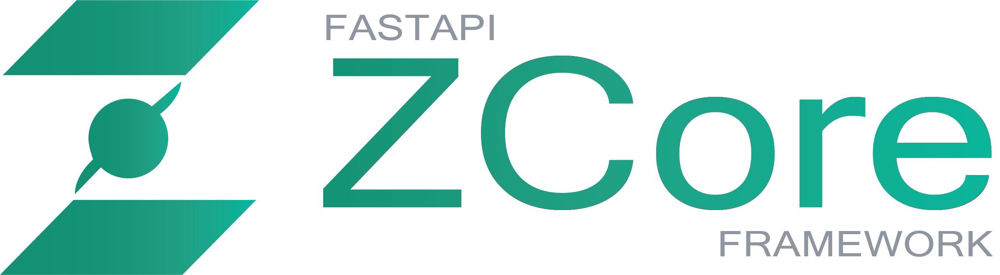

<p align="center">
  
</p>

<p align="center">
  <strong>The official, interactive documentation website for the FastAPI ZCore Framework.</strong><br>
  <em>Engineered with Next.js App Router, Fumadocs, Tailwind CSS, and MDX.</em>
</p>

<p align="center">
  <a href="https://baseryn.github.io/zcore-docs/">
    
  </a>
  <a href="https://github.com/Baseryn/zcore">
    
  </a>
  <a href="https://fumadocs.dev">
    
  </a>
  <a href="https://github.com/Baseryn/zcore-docs/blob/master/LICENSE">
    
  </a>
</p>

---

## 🌐 Overview

This repository houses the source code, interactive landing page, and comprehensive architectural guides for **FastAPI ZCore Framework**.

* 🚀 **Live Site:** [https://baseryn.github.io/zcore-docs/](https://baseryn.github.io/zcore-docs/)
* 📦 **Core Framework Repo:** [https://github.com/Baseryn/zcore](https://github.com/Baseryn/zcore)
* 🐍 **PyPI Package:** [fastapi-zcore-framework](https://pypi.org/project/fastapi-zcore-framework/)

---

## 🛠️ Tech Stack

- **Framework:** [Next.js](https://nextjs.org/) (App Router, Static HTML Export)
- **Documentation Engine:** [Fumadocs](https://fumadocs.dev/) (Macro API, Collections, TypeTable)
- **Diagrams:** [Mermaid](https://mermaid.js.org/) via `beautiful-mermaid`
- **Typography & Icons:** Lucide Icons & Inter Font
- **Deployment:** GitHub Pages (Static CI/CD)

---

## 📂 Project Structure

```text
zcore-docs/
├── content/
│   └── docs/                     # 📝 Markdown & MDX documentation sources
│       ├── meta.json             # Root navigation and sidebar configuration
│       ├── quick-start.mdx       # 5-minute setup guide
│       ├── what-is-zcore.mdx     # Framework philosophy and non-goals
│       ├── comparisons.mdx       # Technical comparison matrix
│       ├── changelog.mdx         # Semantic release notes & migrations
│       ├── quick-learn/          # 10-step end-to-end tutorial
│       ├── how-to/               # Task-focused recipes and guides
│       ├── core-concepts/        # Deep-dive architecture concepts
│       └── api-reference/        # Class, method, and hook API tables
├── public/                       # 🖼️ Static assets (favicons, banners)
├── src/
│   ├── app/                      # Next.js App Router (Landing page & Layouts)
│   ├── components/               # Custom MDX components (Mermaid, etc.)
│   └── lib/                      # Fumadocs source loaders and shared configs
├── next.config.mjs               # Next.js & Fumadocs build configuration
└── package.json                  # Node dependencies and scripts
```

---

## 💻 Local Development

Follow these steps to run the documentation website locally on your machine:

### 1. Prerequisites
- **Node.js:** `v18.17.0` or higher (recommended: Node 20+)
- **Package Manager:** `pnpm` (recommended), `npm`, or `yarn`

### 2. Clone & Install

```bash
# Clone the documentation repository
git clone https://github.com/Baseryn/zcore-docs.git
cd zcore-docs

# Install dependencies
npm install
# or
pnpm install
```

### 3. Start Development Server

```bash
npm run dev
# or
pnpm dev
```

Open [http://localhost:3000](http://localhost:3000) in your browser to see the live hot-reloading site.

### 4. Build & Export

To test the production static export:

```bash
npm run build
```

The compiled static output will be generated inside the `out/` directory.

---

## ✍️ Contributing to Documentation

We welcome documentation improvements, typo fixes, and new how-to guides!

1. Fork this repository.
2. Create a branch: `git checkout -b docs/improve-guide-name`.
3. Edit or create MDX files under `content/docs/`.
4. If you create a new page, add its filename (without `.mdx`) to the corresponding `meta.json`.
5. Verify formatting locally with `npm run build`.
6. Submit a Pull Request.

### MDX Features Supported
- `<Callout type="info|warning|error|success">`
- `<TypeTable type={{ ... }} />`
- `<Tabs items={['A', 'B']}>` & `<Tab value="A">`
- `<Steps>` & `<Step>`
- `<Files>` & `<Folder>` & `<File>`
- `<Accordions>` & `<Accordion>`
- `<Mermaid chart="..." />`

---

## 📄 License

This documentation is open-sourced under the **Apache License 2.0**.  
See the [LICENSE](LICENSE) file for details.

<p align="center">
  <sub>Maintained by the <strong><a href="https://github.com/Baseryn">Baseryn</a></strong>.</sub>
</p>